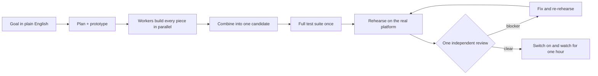

# BGZFLOW

**Run a team of AI coding agents like a real product team, from a plain-English idea to a working launch.**

BGZFLOW is a free, open-source plugin for Claude Code, Codex and Grok. One lead agent plans the work, a swarm of workers builds every piece in parallel, and the whole product is then tested once on the real platform before it goes live. It runs on the agents and subscriptions you already have.

[](LICENSE)
[](CHANGELOG.md)


---

## Why BGZFLOW

AI agents are fast at writing code and bad at finishing products. Left alone they review each other in circles, test pieces that never get assembled, lose track after a restart, and quietly leave finished work switched off. BGZFLOW is a small set of working rules, skills and local guard tools that fix those failure modes:

- **Build the whole thing, then test the whole thing.** Workers build every piece in parallel with fast checks only. Nothing is reviewed or released piece by piece.
- **Prove it on the real platform.** The finished candidate runs its key customer journeys and one rollback on a real preview, staging slot, TestFlight or internal track, with real accounts and money in test mode.
- **One review, four reasons to stop.** A single independent read-only review per release can block only on wrong money, data loss, security or privacy, or a missing rollback, each with a reproduction. Everything else goes on the after-launch list. Repairs are proven by re-running the rehearsal, never by another review.
- **Finished means switched on.** Accepted work goes live for its customers the moment it passes, with an hour of live error-watching. Finished work left off is flagged within a day.
- **You decide once.** You approve the resources and usage limit for a swarm up front. After that the lead runs the work and asks only about genuine product, money or release decisions.
- **Pick up where you left off.** One-page checkpoints and a recovery skill let any agent, on any host, continue a project after a crash, a restart or an account switch.

## How it works



The lead agent recovers the project's current state, proposes a short plan and asks once which workers and usage it may spend. From there it carries the approved work through building, integration, whole testing, the release and recovery. Publishing, store submission and payments still need your explicit authority.

## Install

Requirements: your agent's CLI and Node.js 18 or newer. Python 3.10 or newer is needed only for the optional notes map. BGZFLOW installs no npm packages.

**Claude Code**

```shell
claude plugin marketplace add socialiserapp-design/BGZFLOW
claude plugin install bgzflow@bgzflow
```

**Codex**

```shell
codex plugin marketplace add socialiserapp-design/BGZFLOW
codex plugin add bgzflow@bgzflow
```

**Grok**

```shell
grok plugin marketplace add socialiserapp-design/BGZFLOW
grok plugin install socialiserapp-design/BGZFLOW
```

The [install guide](docs/install.md) covers updating, uninstalling and the optional private settings folder.

## Quick start

Open an existing repository in your agent and describe the result you want:

```text
/bgzflow:swarm Add Apple and Google sign-in, and make sure existing email users keep their accounts
```

Claude Code and Grok load the commands directly. Codex does not load plugin slash commands yet, so ask it:

```text
Read the installed BGZFLOW commands/swarm.md and run that workflow for this goal: <your goal>
```

## Commands

| Command | What it does |
|---|---|
| `/swarm <goal>` | Plan, build every piece in parallel, combine, test the whole and check it independently |
| `/swarm-fix <findings>` | Fix a batch in parallel, re-combine and retest the whole journey (two rounds at most) |
| `/swarm-research <question>` | Investigate several angles in parallel and return one sourced answer |
| `/swarm-design <target>` | Explore at least eight genuinely different designs, then prototype your choice |
| `/swarm-check [candidate]` | Rehearse the complete candidate on the real platform, then run the one review |
| `/swarm-ship <version>` | Prepare a release, switch it on within your authority and watch it live |
| `/swarm-status` | Show running, stale and finished jobs, with duplicates and mismatches flagged |
| `/swarm-resources` | See which agents and accounts are available, and approve what a swarm may use |

Supporting tools: `/bg-heavy` queues heavy local builds one at a time, `/bg-swarm` launches and stops local workers, `/bg-rounds` keeps the repair-round ledger, `/swarm-gate` enforces the swarm's limits and release order, `/doctor` checks for leaked secrets and context costs, `/notes-map` finds the right lines in long project notes, and `/startup-check` keeps start-up reading short.

## What's inside

**Eight skills**, each loaded only when its stage applies:

| Skill | Use it for |
|---|---|
| Plain English Builder | Turning an everyday idea into research, a clickable prototype and a buildable plan |
| Build With Me | Managing a substantial goal end to end, choosing the right stages and workers |
| Personal Product Design | New looks, screens and flows, with eight or more directions and device checks |
| Finish the Whole Job | Turning an agreed plan into one integrated, working product |
| Check It Before Release | Real-platform rehearsal and the single release review |
| Ship and Recover | Switching accepted work on, the first live hour, rollback and incidents |
| Continue My Project | Resuming after a crash, a break or a host or account change without losing work |
| Efficiency | Saving tokens and usage without cutting scope or quality |

**Local guard tools and hooks**: the swarm gate (resources, usage limits, ownership, retry and release order), resource and status views, a heavy-job queue, a resource governor that protects disk and build slots, a worker mailbox, account-route receipts and a real-clock hook. See [swarm gate](docs/swarm-gate.md), [testing ladder](docs/testing-ladder.md), [mailbox](docs/mailbox.md), [resource governor](docs/resource-governor.md) and [account routing](docs/account-routing.md).

## Safety and privacy

- Hooks are small Node.js programs that run on your machine, with no dependencies. Read [SECURITY.md](SECURITY.md) and review `hooks/hooks.json` before you install or update.
- Your own notes, routes and project list live in a private folder outside this repository (`~/.bgzflow/overlay/` by default) and are never published.
- BGZFLOW never buys capacity, never switches accounts silently and never publishes, submits to a store or moves money without your recorded authority.
- Continuous integration runs the test suite, a manifest drift check, a leak check over files, history and identities, and gitleaks.

## Project status

BGZFLOW is used every day to run several real products built by a one-person studio, across Claude Code and Codex. It is young and moving quickly; see the [changelog](CHANGELOG.md) and [verification evidence](docs/proof.md). Issues and pull requests are welcome. Please report security problems through a private security advisory.

## Licence

MIT. Copyright (c) 2026 BGZFLOW contributors. Third-party ideas and sources are credited in [ATTRIBUTION.md](ATTRIBUTION.md).
