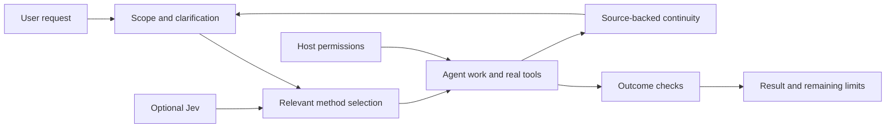

# BGZFLOW

**Created and led by [Simeon Kontogeorges](https://github.com/socialiserapp-design).**

[GitHub](https://github.com/socialiserapp-design) ·
[LinkedIn](https://www.linkedin.com/in/simeon-konto-soclo/) ·
[X](https://x.com/socloapp)

An adaptive workflow foundation for getting useful, checked results from AI.
BGZFLOW connects a selectively loaded skill library, shared working rules,
context recovery, narrow safety hooks and outcome checks into one portable system.
Use one AI provider or several, within the capabilities of the host you choose.

Simeon's contribution is the system's product vision, workflow requirements and
integration direction: bringing these methods into a coherent working process,
identifying failures in real projects, and driving the adaptations and evaluation
work. Original implementation and substantial adaptations were developed with AI
assistance under his direction. See [authorship and contributions](AUTHORS.md).

## Install

The repository includes a ready-built plugin at `plugins/bgzflow`; ordinary users
do not need to install development dependencies. Use one copy in each host.

**Claude Code, including compatible Desktop Code sessions:**

```sh
claude plugin marketplace add socialiserapp-design/BGZFLOW
claude plugin install bgzflow@bgzflow
```

Reload plugins in an existing session using its supported reload command.

**Codex versions with native plugin support:**

```sh
codex plugin marketplace add socialiserapp-design/BGZFLOW
codex plugin add bgzflow@bgzflow
```

Review BGZFLOW's hooks through the host's normal trust controls. Host versions
differ; do not approve unrelated hooks to clear a warning. Antigravity uses its
separate package from [Releases](https://github.com/socialiserapp-design/BGZFLOW/releases).
See [installation](docs/install.md) and [host boundaries](docs/packaging-and-hosts.md).

## The workflow

1. Understand the intended outcome and clarify consequential unknowns.
2. Select relevant methods, inspect existing solutions and work within the user's authority.
3. Build or produce the requested result, adapting methods as the work changes.
4. Check the actual result and preserve decisions, corrections and remaining uncertainty.

The bundled library contains **100 skills** covering clarification, research,
engineering, product design, accessibility, sound, SVG, testing, risk and recovery.
It includes a design master, specialist design methods and research methods.
Large references and assets stay available on demand.

Optional Jev routing uses the official TypeSafe SDK and your own protected key.
Without it, the main agent selects from the same library. Jev can recommend
methods and an execution arrangement; the host supplies actual model capacity,
tools and permissions. A model catalogue does not create extra worker capacity.

## What makes the parts work together

The shared contract keeps the latest user decisions above method defaults.
Methods contribute expertise without granting authority, adding unrelated work or
forcing a separate process. Original source and attribution remain traceable.


```mermaid
flowchart LR
  A[User request] --> B[Scope and clarification]
  B --> C[Relevant method selection]
  J[Optional Jev] --> C
  C --> D[Agent work and real tools]
  H[Host permissions] --> D
  D --> E[Outcome checks]
  E --> F[Result and remaining limits]
  D --> R[Source-backed continuity]
  R --> B
```

BGZFLOW's integration work includes complete selected-procedure delivery,
stage-sensitive reselection without compulsory planning, native event-based
continuity, source-backed follow-up recovery, limited mechanical checks and tests
of saved outcomes. SuperAgent-inspired session interfaces separate delivery from
consumption and reconcile uncertain actions before replay; host integrations must
supply genuine observations. No manual success receipt is required.

## Evidence and limits

The [verification report](docs/verification-and-performance.md) separates local
regressions, actual host observations, routing measurements and unverified effects.
Tests inspect real files and hidden inputs; a model saying "done" is not proof.

Automatic selection is advisory and can be wrong. A large or unavailable method
must not discard other useful recommendations: incomplete comparisons are marked
**partial**, with the remaining sources available to the main agent. The agent
still needs to check domain, prerequisites and the user's actual task before
applying a method. External skill libraries have not all been rewritten or tested
as part of this bundle.

BGZFLOW cannot guarantee obedience, zero hallucinations or complete recovery in
every app. Hooks cannot intercept every arbitrary shell or embedded tool action.
Some worker controls need host support. Simple arithmetic smoke tests made zero
Jev calls; this does not prove a general speed or cost improvement.

## Develop and verify

```sh
npm ci
npm test
npm run build
npm run build:antigravity
```

Source builds are written to `dist/`. The committed ready-built plugin is a
release artifact. Normal use does not require running BGZFLOW commands manually.
See [the foundation design](docs/adaptive-foundation.md),
[enforcement boundaries](docs/enforcement-boundaries.md) and
[contributing](CONTRIBUTING.md).

## Licence and acknowledgements

Original BGZFLOW work uses the [MIT licence](LICENSE). Imported code, methods and
assets retain their own terms, including some copyleft and asset-specific terms.
The whole collection must not be described as universally MIT-licensed.

[Third-party notices](THIRD_PARTY_NOTICES.md), [source records](ATTRIBUTION.md) and
per-skill notices explain where material came from and how it was adapted.
Those sources underpin the work; BGZFLOW's original contribution is the integrated
workflow, its working contract, adaptations, host connections and evaluation design.
Research references do not imply endorsement or implementation of an entire paper.


Native private learning can retain source-linked proposals during ordinary work. Actual failed tools are recorded quietly; no background model job or manual user form is required. A preconfigured owner evaluator must prove a baseline failure corrected on regression and unseen cases before a procedure is adopted and delivered in later project sessions. Missing checks leave it unverified; this is not an always-on autonomous optimizer. See [native learning](docs/native-learning.md).
